# Library Management System

## Описание

Library Management System - это приложение для управления библиотекой, позволяющее работать с книгами, читателями и займами книг. Приложение использует Java, JPA (Java Persistence API) для взаимодействия с базой данных и RESTful веб-сервисы для работы с клиентом.

## Основные возможности

- Управление книгами:
  - Получение списка всех книг.
  - Получение информации о книге по её ID.
  - Добавление новой книги.
  - Обновление информации о существующей книге.
  - Удаление книги по её ID.

- Управление выдачей/сдачей книг:
  - Получение списка выдач/сдач.
  - Получение информации о выдаче/сдаче по его ID.
  - Добавление нового выдачи/сдачи.
  - Обновление информации о существующей выдаче/сдаче.
  - Удаление выдачи/сдачи по его ID.

- Управление читателями:
  - Получение списка всех читателей.
  - Получение информации о читателе по его ID.
  - Добавление нового читателя.
  - Обновление информации о существующем читателе.
  - Удаление читателя по его ID.

## Установка и запуск

### Требования
- Eclipse EE
- Java 21
- Maven
- Tomcat 9
- PostgreSQL
- Hibernate
- REST (jaxrx, jersey)
- Dependency Inversion (Guice)
- Logger (log4j2)
- JUnit 5

## Базы данных

Приложение Library Management System использует PostgreSQL в качестве базы данных для хранения информации о книгах, читателях и выдаче книг. Для взаимодействия с базой данных используется Java Persistence API (JPA) с помощью Hibernate.

### Конфигурация
1. Настройка подключения

В файле persistence.xml, который находится в директории src/main/resources/META-INF/, заданы параметры подключения к базе данных PostgreSQL:

jdbc:postgresql://localhost:5432/library_db - URL для подключения к базе данных PostgreSQL.

Схема базы данных представлена в файле db_schema.sql в директории src/main/resources/

2. Hibernate и JPA

Hibernate используется для объектно-реляционного отображения (ORM), что позволяет взаимодействовать с базой данных с помощью Java объектов. JPA абстрагирует детали работы с базой данных, обеспечивая удобный интерфейс для выполнения запросов и управления транзакциями.

## Работа приложения
Приложение Library Management System предоставляет RESTful API для выполнения операций с книгами, читателями и выдачей книг. Веб-сервисы реализованы с использованием Jersey (JAX-RS), который обеспечивает обработку HTTP запросов и ответов. Для проверки функциональности API был использован инструмент для тестирования RESTful сервисов Postman.

### Примеры запросов
Запросы были выполнена с помощь 
Примеры HTTP запросов для работы с книгами (с читателями аналогично):

- Получить все книги: 
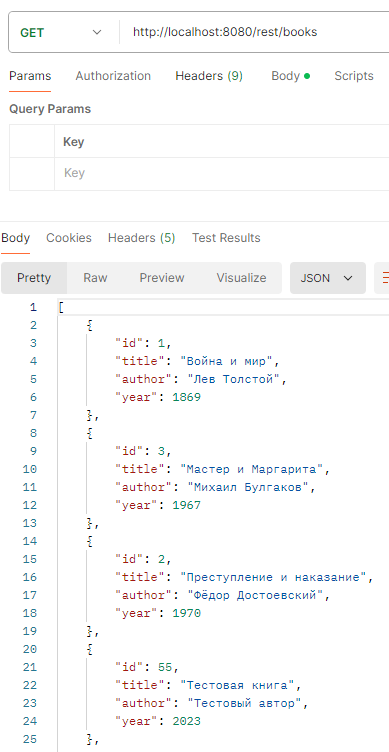

- Получить книгу по ID: 
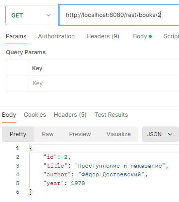

- Добавить книгу: 
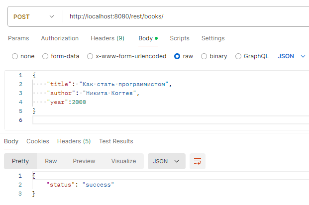  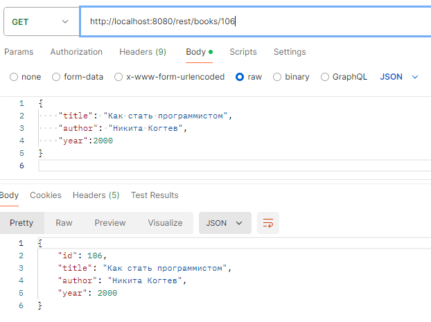

- Обновить книгу: 
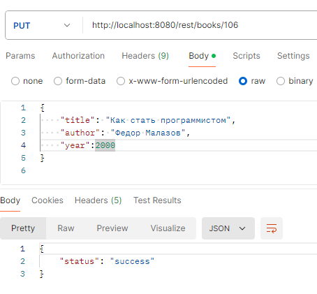  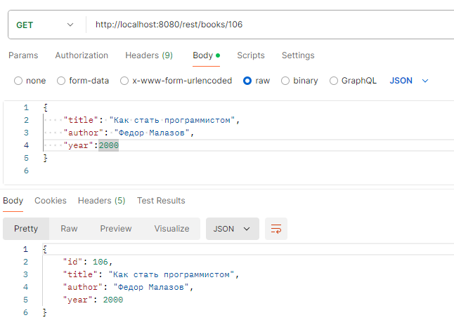 

- Удалить книгу: 
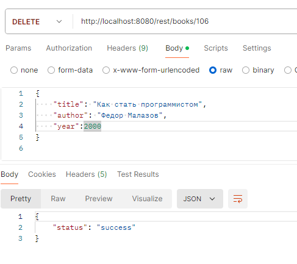  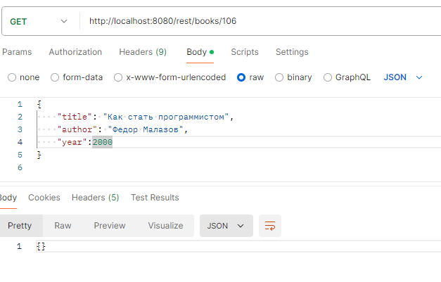

Примеры HTTP запросов для работы с выдачей/сдачей книг:

- Получение всех выдач/сдач книг: 
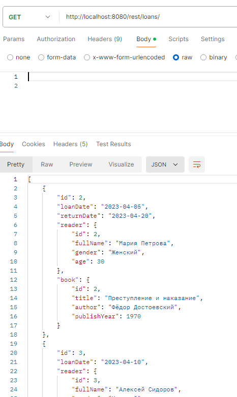 

- Получение выдачи/сдачи книги по ID: 
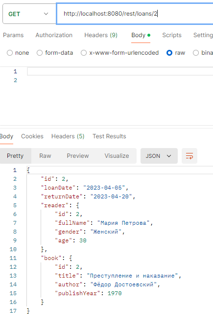

- Добавление новой выдачи/сдачи книги: 
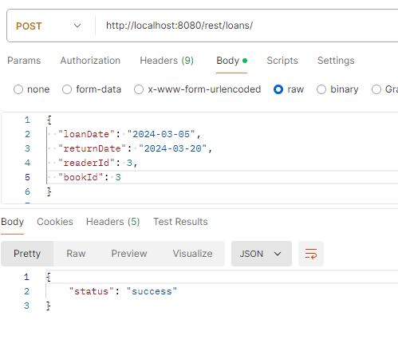  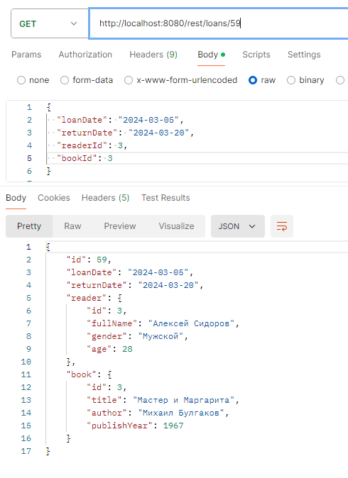

- Обновление информации о выдаче/сдаче книги по ID:  
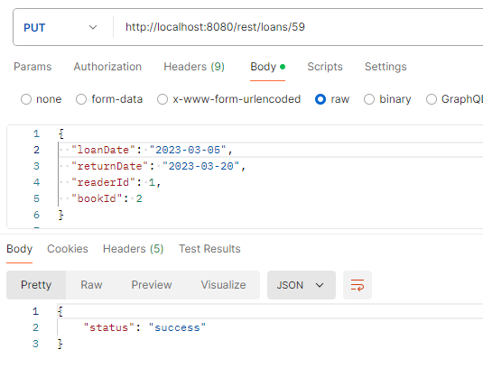 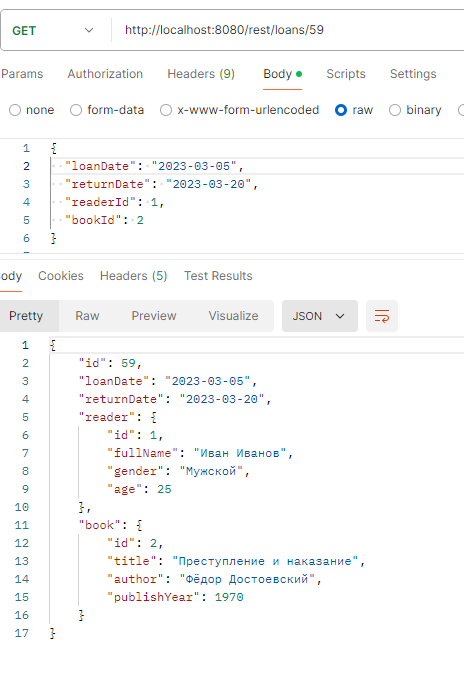

Удаление выдачи/сдачи книги по ID: 
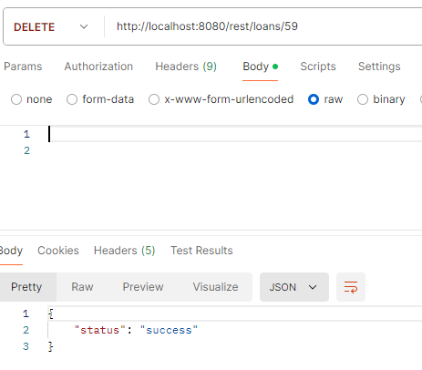  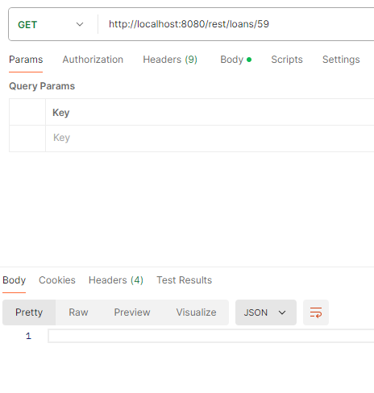